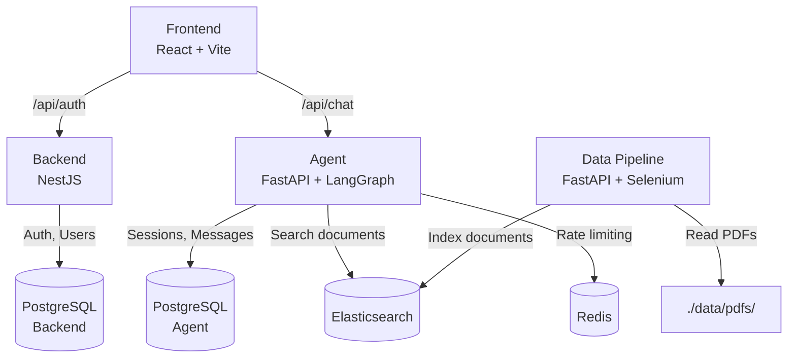

# VIE Law Assistant

VIE Law Assistant is a modular, containerized system designed to provide legal information retrieval and conversational AI services for Vietnamese law documents. It leverages large language models (LLMs), Elasticsearch-based document retrieval, and caching/rate-limiting mechanisms to deliver fast, accurate, and scalable legal assistance.

## Features

- **Conversational AI** — Chatbot interface powered by LangGraph for querying Vietnamese law documents.
- **RAG Pipeline** — Smart routing between direct LLM response and document-augmented retrieval.
- **Document Retrieval** — Efficient search using sentence-transformers embeddings and Elasticsearch.
- **PDF Crawling & OCR** — Automated ingestion of legal PDFs from government sources with text extraction.
- **Authentication** — JWT-based auth with register, login, refresh, and logout flows.
- **Session Management** — Persistent chat sessions and message history.
- **Rate Limiting** — Redis-backed per-IP rate limiting.
- **Microservices Architecture** — Decoupled services orchestrated via Docker Compose.

## Project Structure

```
├── agent/                          # AI Agent service (FastAPI + LangGraph)
│   └── app/
│       ├── api/                    #   API routes (chat, sessions, health)
│       ├── core/                   #   Agent graph (route → RAG → respond)
│       ├── db/                     #   SQLAlchemy models & engine
│       ├── graph/                  #   LangGraph nodes, state, LLM client
│       └── modules/                #   Auth, Chat, Documents modules
├── backend/                        # Auth & user service (NestJS + Prisma)
│   ├── prisma/                     #   Database schema
│   └── src/modules/                #   Auth, Health modules
├── data-pipeline/                  # Document crawler & indexer (FastAPI)
│   └── app/
│       ├── core/                   #   Crawler, downloader, OCR, text splitter
│       └── api/                    #   Scheduler & crawl endpoints
├── frontend/                       # Web UI (React + Vite + TypeScript)
│   └── src/
│       ├── components/             #   ChatInput, ChatMessage, SessionList, Auth forms
│       ├── pages/                  #   AuthPage, ChatPage
│       ├── services/               #   Axios API client
│       └── hooks/                  #   useAuth
├── configs/                        # Environment & Redis configuration
│   ├── .env.example                #   Environment variable template
│   └── redis.conf                  #   Redis config
├── data/                           # Persistent data (mounted as volumes)
│   ├── elasticsearch/
│   ├── pdfs/                       #   Source PDFs for ingestion
│   ├── postgresql-backend/
│   └── postgresql-agent/
├── docker-compose.yaml             # Docker Compose orchestration
└── README.md
```

## Architecture



## Services

| Service | Tech Stack | Port | Description |
|---|---|---|---|
| **Backend** | NestJS, Prisma, PostgreSQL | 3000 | User authentication (register/login/refresh/logout) |
| **Agent** | FastAPI, LangGraph, SQLAlchemy, sentence-transformers | 8001 | AI chat with RAG routing, session & message management |
| **Data Pipeline** | FastAPI, Selenium, pdf2image, pytesseract | 8080 | PDF crawling, OCR, text splitting, Elasticsearch indexing |
| **Frontend** | React 18, Vite 6, TypeScript, React Router | 3000 (via Nginx) | Chat UI with auth and session management |
| **PostgreSQL (Backend)** | PostgreSQL 17 | 5432 | Users & refresh tokens |
| **PostgreSQL (Agent)** | PostgreSQL 17 | 5433 | Chat sessions & messages |
| **Elasticsearch** | Elasticsearch 8.19 | 9200 | Document search & embeddings |
| **Redis** | Redis 8 | 6379 | Rate limiting & caching |

## Getting Started

### Prerequisites

- [Docker](https://docs.docker.com/get-docker/) ≥ 24
- [Docker Compose](https://docs.docker.com/compose/install/) ≥ 2.20

### Setup

1. **Clone the repository**

```bash
git clone https://github.com/NgocDuy3112/vie-law-assistant.git
cd vie-law-assistant
```

2. **Configure environment variables**

```bash
cp configs/.env.example configs/.env
```

Then edit `configs/.env` and fill in the required values:

```env
# PostgreSQL — Backend
POSTGRES_BACKEND_USER=your_user
POSTGRES_BACKEND_PASSWORD=your_password
POSTGRES_BACKEND_DB=vie_law_backend

# PostgreSQL — Agent
POSTGRES_AGENT_USER=your_user
POSTGRES_AGENT_PASSWORD=your_password
POSTGRES_AGENT_DB=vie_law_agent

# Elasticsearch
ELASTICSEARCH_URL=http://elasticsearch:9200
ELASTICSEARCH_INDEX=legal_documents

# Redis
RATE_LIMIT_URI=redis://:V1eLaw@ssistant@redis:6379/0

# Embedding (sentence-transformers compatible endpoint)
EMBEDDING_URL=http://localhost:8080/embeddings
EMBEDDING_DIMENSION=768

# LLM (OpenAI-compatible API)
LLM_BASE_URL=http://your-llm-endpoint/v1
LLM_MODEL=your-model-name
NUM_REQUESTS_PER_MINUTE=60
REQUEST_TIMEOUT_SECONDS=120

# Data Pipeline
LEGAL_LAW_URL=https://vbpl.vn
LIMIT=50
TIMEOUT=30
CHROMEDRIVER_PATH=/usr/bin/chromedriver
PDF_DOWNLOAD_DIR=/src/data/pdfs
DOWNLOAD_TIMEOUT=30
```

3. **Add legal PDFs** _(optional)_

Place your Vietnamese law PDF files in the `data/pdfs/` directory. They will be processed by the Data Pipeline.

4. **Start all services**

```bash
docker-compose up --build
```

5. **Access the application**

| Service | URL |
|---|---|
| Frontend (Web UI) | http://localhost:3000 |
| Agent API (Swagger) | http://localhost:8001/docs |
| Backend API | http://localhost:3000/api/auth |
| Elasticsearch | http://localhost:9200 |

## API Endpoints

### Backend — `POST /auth`

| Method | Endpoint | Description |
|---|---|---|
| `POST` | `/auth/register` | Register a new user |
| `POST` | `/auth/login` | Login and receive JWT tokens |
| `POST` | `/auth/refresh` | Refresh access token |
| `POST` | `/auth/logout` | Revoke refresh token |
| `GET` | `/health` | Health check |

### Agent — `POST /v1`

| Method | Endpoint | Description |
|---|---|---|
| `POST` | `/v1/response` | Send chat messages (with RAG routing) |
| `GET` | `/v1/sessions` | List user's chat sessions |
| `GET` | `/v1/sessions/:id/messages` | Get messages for a session |
| `DELETE` | `/v1/sessions/:id` | Delete a session |
| `GET` | `/health` | Health check |

## Development

### Local Development (without Docker)

**Backend (NestJS):**

```bash
cd backend
npm install
npx prisma generate
npm run start:dev
```

**Agent (FastAPI):**

```bash
cd agent
pip install -e .
uvicorn app.main:app --reload --port 8001
```

**Frontend (React):**

```bash
cd frontend
npm install
npm run dev
```

### Running Tests

```bash
# Agent tests
cd agent
pytest
```

## Configuration

| File | Description |
|---|---|
| `configs/.env` | All environment variables for all services |
| `configs/redis.conf` | Redis server configuration |
| `frontend/nginx.conf` | Nginx reverse proxy and SPA routing |
| `backend/prisma/schema.prisma` | Database schema for auth service |
| `docker-compose.yaml` | Service orchestration and port mapping |

## TODO

- [x] Write unit tests for each service (agent: pytest, data-pipeline: pytest, backend: jest)
- [ ] Add streaming response for chat
- [ ] Add admin dashboard for document management
- [ ] Set up CI/CD pipeline
- [ ] Add comprehensive logging and monitoring

## Tech Stack

- **Backend** — [NestJS](https://nestjs.com/), [Prisma](https://www.prisma.io/), [PostgreSQL](https://www.postgresql.org/)
- **Agent** — [FastAPI](https://fastapi.tiangolo.com/), [LangGraph](https://langchain-ai.github.io/langgraph/), [sentence-transformers](https://www.sbert.net/)
- **Data Pipeline** — [FastAPI](https://fastapi.tiangolo.com/), [Selenium](https://www.selenium.dev/), [Tesseract OCR](https://github.com/tesseract-ocr/tesseract)
- **Frontend** — [React](https://react.dev/), [Vite](https://vite.dev/), [TypeScript](https://www.typescriptlang.org/)
- **Infrastructure** — [Docker](https://www.docker.com/), [Elasticsearch](https://www.elastic.co/elasticsearch/), [Redis](https://redis.io/), [Nginx](https://nginx.org/)

## License

This project is for educational and research purposes.